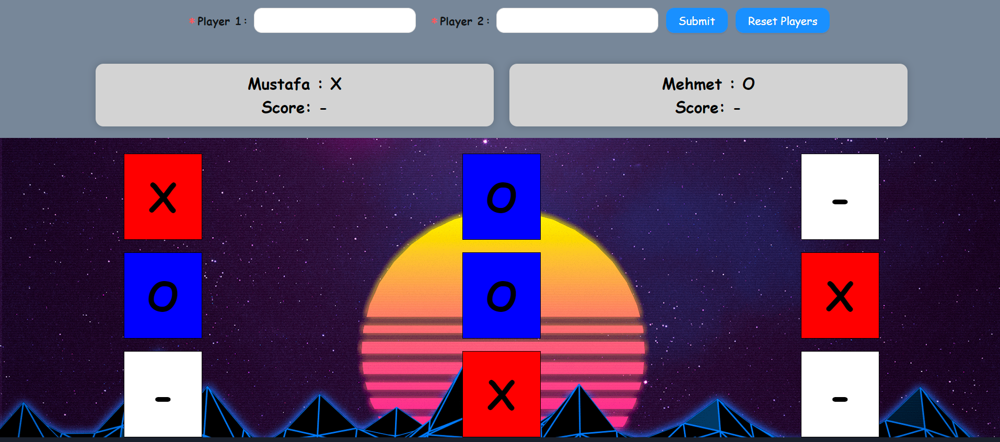

# Whats the Tic Tac Toe game?
Tic Tac Toe is a game played by two players on a 3x3 grid. The goal of the game is to get three of your tokens in a row.

## How do I play?

1. Please add your name to inputs. Player 1 is X and Player 2 is O.
2. Please select a grid in between 3 and 9.
3. Showing $ dollar symbol in the personal card details of the winner of the game.
4. Dont forget, in this game no score limits. Push your limits to infinity. :)

# Technologies used in this project

- ReactJS
- Redux
- LocalStorage
- Ant Design
- Chakra UI

# Screens

